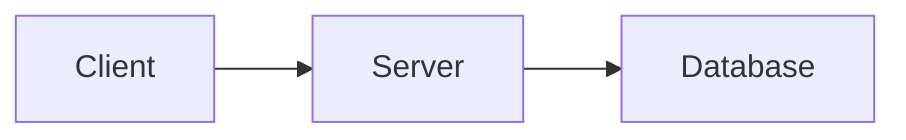

# Slidev Slide Templates

## Title Slides

### Standard Cover
```markdown
---
layout: cover
background: /cover.jpg
class: text-center
---

# Presentation Title

## Subtitle

Author · Date
```

### Minimal Cover
```markdown
---
layout: cover
class: text-center
---

# Title

Subtitle or tagline
```

### Gradient Background
```markdown
---
layout: cover
background: linear-gradient(135deg, #667eea 0%, #764ba2 100%)
class: text-center text-white
---

# Modern Title

With gradient background
```

## Section Dividers

### Simple Section
```markdown
---
layout: section
---

# Part 1: Introduction
```

### Styled Section
```markdown
---
layout: section
background: linear-gradient(to right, #667eea, #764ba2)
class: text-white
---

# Part 2: Implementation
```

## Content Slides

### Bullet Points with Animation
```markdown
---
layout: default
---

# Key Points

<v-clicks>

- First important point
- Second important point
- Third important point

</v-clicks>
```

### Two Columns Comparison
```markdown
---
layout: two-cols
---

# Before

- Old approach
- Manual process
- Time consuming

::right::

# After

- New approach
- Automated
- Efficient
```

## Code Slides

### Code with Explanation
````markdown
---
layout: two-cols
---

```typescript
function greet(name: string) {
  return `Hello, ${name}!`
}
```

::right::

# Explanation

- Function takes a string
- Returns greeting message
- Type-safe with TypeScript
````

### Code with Line Highlighting
````markdown
---
layout: default
---

# Step by Step

```ts {1|3-4|all}
const step1 = 'First'

const step2 = 'Second'
const step3 = 'Third'
```
````

### Interactive Code (Monaco)
````markdown
---
layout: default
---

# Try It

```ts {monaco-run}
console.log('Hello, Slidev!')
```
````

## Data & Diagrams

### Big Number / Fact
```markdown
---
layout: fact
---

# 42%
Improvement in performance
```

### Mermaid Diagram
````markdown
---
layout: default
---

# Architecture


````

## Closing Slides

### Thank You
```markdown
---
layout: end
---

# Thank You

Questions?
```

### Contact Info
```markdown
---
layout: end
class: text-center
---

# Get in Touch

email@example.com

@twitter · github.com/user
```
