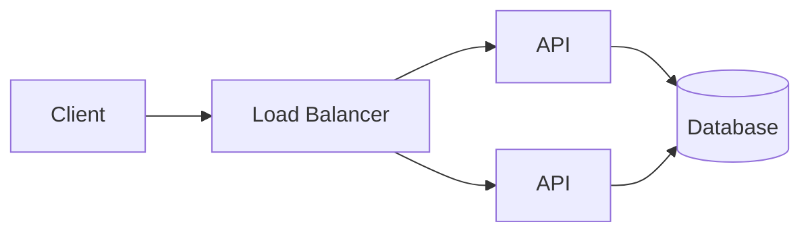
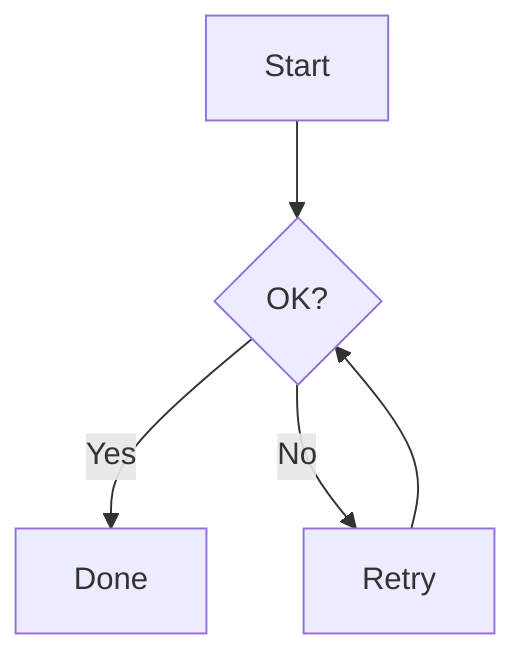
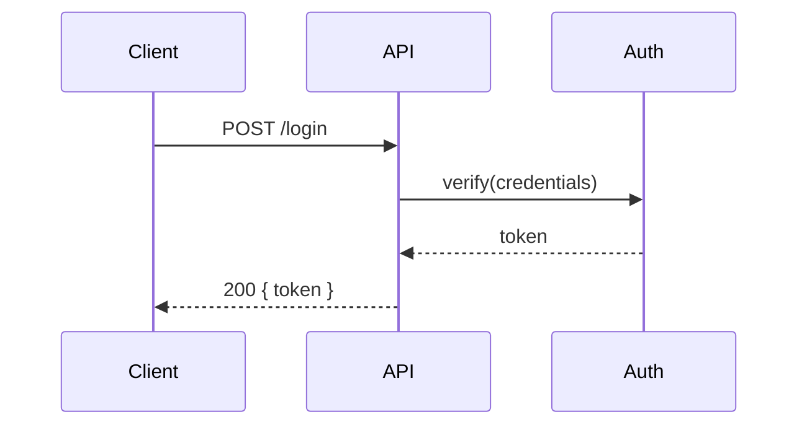
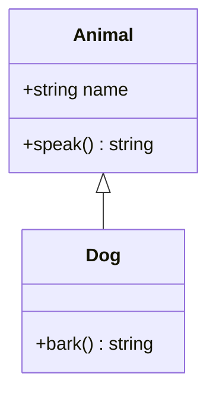
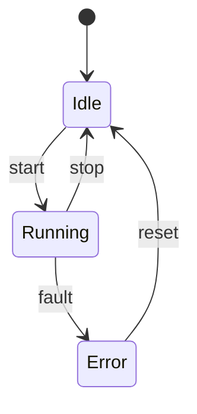
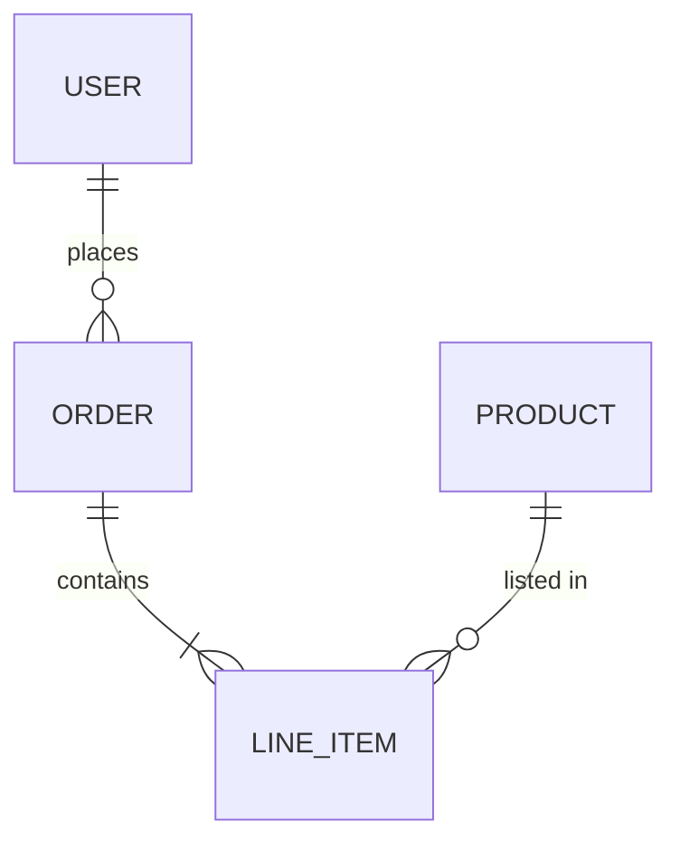
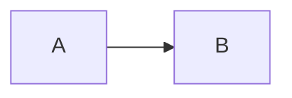
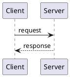
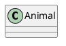

# Diagrams and Math

## Mermaid

The go-to for flowcharts, sequence diagrams, class diagrams, state machines, ERDs, Gantt, and architecture sketches.

````markdown

````

### Common diagram types

**Flowchart:**

````markdown

````

Directions: `TD` (top-down), `LR` (left-right), `BT` (bottom-top), `RL` (right-left).

**Sequence diagram:**

````markdown

````

**Class diagram:**

````markdown

````

**State diagram:**

````markdown

````

**ERD:**

````markdown

````

### Sizing and theming

````markdown

````

Options:
- `scale` — 0.5 to 2.0 typically
- `theme` — `default`, `dark`, `forest`, `neutral`

Global defaults in headmatter:

```yaml
mermaid:
  theme: 'dark'
```

### When Mermaid isn't enough

- Complex architecture diagrams with custom icons → use [Excalidraw](https://excalidraw.com/) or [Draw.io](https://draw.io), export to PNG/SVG, drop in `public/`
- Animated flows → use a video or a sequence of Mermaid diagrams on click-stepped slides

## PlantUML

Server-side rendering of PlantUML diagrams. No local install needed — uses the public PlantUML server by default.

````markdown

````

Sizing:

````markdown

````

For offline use (recommended for conference WiFi), configure a local PlantUML server and set `plantuml.server` in `slidev.config.ts`.

**When to prefer PlantUML over Mermaid:** more diagram types (component, deployment, use-case, timing), more styling options, historical ubiquity. Otherwise Mermaid is usually sharper-looking.

## KaTeX — Math Formulas

Inline: `$ E = mc^2 $`
Block: `$$ ... $$`

```markdown
Schrödinger's equation:

$$
i\hbar \frac{\partial}{\partial t} \Psi = \hat{H} \Psi
$$

Where $\hbar = h/(2\pi)$ is the reduced Planck constant.
```

### Numbered equations

```markdown
$$
\begin{equation}
f(x) = x^2 + 2x + 1
\end{equation}
$$
```

### Aligned equations

```markdown
$$
\begin{aligned}
a &= b + c \\
  &= d - e
\end{aligned}
$$
```

### Common LaTeX in tech talks

```
\sum_{i=0}^{n} i^2       → Σ
\prod_{i=1}^{n}          → ∏
\frac{a}{b}              → a/b
\sqrt{x}                 → √x
\sqrt[3]{x}              → ∛x
\int_{a}^{b} f(x)\,dx    → ∫
\infty                   → ∞
\alpha, \beta, \gamma    → α β γ
\rightarrow, \Rightarrow → → ⇒
\land, \lor, \neg        → ∧ ∨ ¬
\in, \notin, \subset     → ∈ ∉ ⊂
\forall, \exists         → ∀ ∃
\mathcal{O}(n \log n)    → 𝒪(n log n)
```

### Disabling KaTeX (performance)

If you don't use math, disable for faster reload:

```yaml
# slidev.config.ts
export default defineConfig({
  disabledFeatures: ['katex'],
})
```

## Chemistry Formulas

Via the `mhchem` KaTeX extension (bundled with Slidev):

```markdown
$$
\ce{ H2O + CO2 -> H2CO3 }
$$

$$
\ce{ 2H2 + O2 ->[\Delta] 2H2O }
$$
```

## Images

Markdown syntax:

```markdown

{ width=400 class='rounded-lg shadow' }
```

Place images in `public/` and reference with a leading `/`. URLs also work.

### Sized via HTML

```markdown

```

### SVG inline

```markdown
<svg viewBox="0 0 100 100" class="w-48 mx-auto">
  <circle cx="50" cy="50" r="40" fill="currentColor" />
</svg>
```

Inline SVG picks up the current color scheme (via `fill="currentColor"`), useful for light/dark support.

## Choosing the Right Visual

| Intent | Tool |
|---|---|
| Sequence of calls / state transitions | Mermaid sequence or state |
| Architecture overview | Mermaid graph, or Excalidraw image |
| Class relationships | Mermaid class diagram |
| Data model | Mermaid ERD |
| Hand-drawn vibe | Excalidraw export |
| Precise technical drawing with colors | Figma/Illustrator export to SVG |
| Live animation | Lottie, video, or click-stepped slides |
| Math | KaTeX |
| Chemistry | KaTeX + mhchem |

**Golden rule:** if a diagram takes >30 seconds to explain, it's too complex for a slide. Split it, or animate the reveal with multiple versions in a Magic-Move-like fashion using click-stepped slides.
