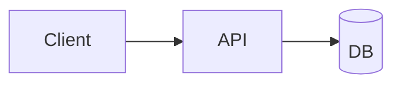

# Export and Deployment

## PDF Export

The most common export. Attendees love PDFs.

### Setup

```bash
pnpm add -D playwright-chromium
pnpm exec playwright install chromium
```

(One-time, ~200 MB disk.)

### Export

```bash
pnpm export                                  # default: slides-export.pdf
pnpm export --output my-talk.pdf
pnpm export --with-clicks                    # each click becomes a page
pnpm export --dark                           # force dark color scheme
pnpm export --range 1,4-8                    # only specific slides
pnpm export --timeout 60000                  # ms, for heavy slides
pnpm export --executable-path /path/to/chrome  # use existing Chrome
```

### `--with-clicks` — when to use

Animated decks often need this. Without it, PDF pages show the **end state** of each slide (all clicks revealed). With `--with-clicks`, each intermediate click is its own page — the PDF shows the talk like a flipbook.

**Rule of thumb:** use `--with-clicks` if the talk makes sense only as a sequence; skip it for reference material.

### Headmatter defaults

```yaml
exportFilename: my-talk
export:
  format: pdf
  dark: false
  withClicks: false
  timeout: 30000
```

Then `pnpm export` uses these.

### Common PDF pitfalls

- **Monaco blocks render as their initial state.** TwoSlash is better for PDF.
- **Mermaid diagrams** can fail if the Playwright headless browser times out — bump `--timeout`.
- **Fonts missing in PDF** usually means `provider: google` couldn't fetch. Bundle locally or set `fallbacks: true`.
- **Videos don't render.** Replace with a GIF or a representative screenshot for PDF export.

## PPTX Export

```bash
pnpm export --format pptx
```

Output is a `.pptx` with each slide as an image. **You lose interactivity.** Use only when the venue mandates PowerPoint.

## PNG Export

```bash
pnpm export --format png
```

One PNG per slide in `slides-export/`. Useful for thumbnails, blog embeds, or conference program covers.

## Markdown Export

```bash
pnpm export --format md
```

Each slide as markdown with inline PNGs. Useful for posting talk notes to a blog.

## Static Site Build

```bash
pnpm build                       # output: dist/
pnpm build --base /talks/slidev/ # for subdirectory hosting
```

The `dist/` directory is a complete static site. Deploy anywhere:

## Deploy to GitHub Pages

`.github/workflows/deploy.yml`:

```yaml
name: Deploy Slidev

on:
  push:
    branches: [main]

permissions:
  contents: read
  pages: write
  id-token: write

jobs:
  build:
    runs-on: ubuntu-latest
    steps:
      - uses: actions/checkout@v4

      - uses: pnpm/action-setup@v4
        with:
          version: 9

      - uses: actions/setup-node@v4
        with:
          node-version: 24
          cache: pnpm

      - run: pnpm install --frozen-lockfile

      - run: pnpm build --base /${{ github.event.repository.name }}/

      - uses: actions/upload-pages-artifact@v3
        with:
          path: dist

  deploy:
    needs: build
    runs-on: ubuntu-latest
    environment:
      name: github-pages
      url: ${{ steps.deployment.outputs.page_url }}
    steps:
      - id: deployment
        uses: actions/deploy-pages@v4
```

In the repo: **Settings → Pages → Source: GitHub Actions**.

## Deploy to Vercel

1. Push to GitHub
2. Import the repo at <https://vercel.com/new>
3. Framework preset: **Other**
4. Build command: `pnpm build`
5. Output directory: `dist`
6. Install command: `pnpm install --frozen-lockfile`

Zero-config for custom domains.

## Deploy to Netlify

`netlify.toml`:

```toml
[build]
  publish = "dist"
  command = "pnpm build"

[build.environment]
  NODE_VERSION = "24"
  NPM_FLAGS = "--version" # trick to prevent npm install; let pnpm handle

[[redirects]]
  from = "/*"
  to = "/index.html"
  status = 200
```

## Deploy to Cloudflare Pages

1. Connect the repo in the Cloudflare dashboard
2. Build command: `pnpm install && pnpm build`
3. Build output: `dist`
4. Environment: `NODE_VERSION = 24`

## Hosting for In-Person Talks

For conference WiFi that will absolutely fail you, **always also have the local `dist/` on the presenter's laptop**. Preview with:

```bash
pnpm build
pnpm dlx serve dist
```

Or just present from dev mode — `pnpm dev` runs fully offline.

## Presenter Mode

Run the dev server, then open `http://localhost:3030/presenter/` on a second display or tablet.

Features:
- Next slide preview
- Timer
- Notes visible
- Click count / total
- Drawing tools

### Presenter on mobile

From your laptop running `pnpm dev`:

1. Find your local IP (e.g. `192.168.1.42`)
2. On your phone: `http://192.168.1.42:3030/presenter/`

Useful when you want a handheld remote.

### External controller

Slidev responds to standard presenter remotes (left/right arrow, page up/down). A `$5` wireless presenter clicker works out of the box.

## Recording Mode

```yaml
record: true
```

Enables a recording panel in presenter mode. Captures webcam + slides. Best to use OBS for real talks.

## Accessibility

When the deck or its PDF export is shared publicly, a few things meaningfully improve reach. None of these are free — all require effort from the author.

### Images

- **Every `` gets an `alt` attribute.** Decorative images: `alt=""` (empty — signals "skip" to screen readers). Informational images: describe what the image conveys.
- For background images via `background:`, the image is purely decorative; no alt needed.

```markdown


<!-- Decorative -->

```

### Diagrams

- Mermaid and PlantUML diagrams are rendered as SVG. **Screen readers don't read them** meaningfully. Provide a text alternative:

```markdown


<!-- Screen-reader text equivalent -->
<div class="sr-only">
  Architecture: the client sends requests to an API, which reads from a database.
</div>
```

- Add `.sr-only` to your global CSS (visually hidden, read by screen readers):

```css
.sr-only {
  position: absolute;
  width: 1px;
  height: 1px;
  overflow: hidden;
  clip: rect(0,0,0,0);
  white-space: nowrap;
  border: 0;
}
```

### Color

- **Never communicate state by color alone.** Pair green/red with ✓/✗ icons, or words ("passing"/"failing"). See `06-themes-styling.md` → Projector Legibility for palette choices.

### Keyboard and focus

- Slidev navigation works via arrow keys by default. If you add custom interactive elements (buttons, links), make sure they're keyboard-reachable — test with Tab.

### PDF export limitations

- Slidev's PDF export produces a **flat PDF** — no tagged structure, no reading-order metadata, no heading hierarchy. Screen-reader users can't navigate by heading.
- If a fully accessible PDF is required, export to Markdown (`pnpm export --format md`), then convert to tagged PDF with a tool like Pandoc or an AT-aware PDF generator. It loses visual fidelity but gains structure.
- As a workaround, publish the static HTML build (`pnpm build`) alongside the PDF — HTML keeps the heading structure and is screen-reader friendlier.

## Checklist Before a Live Talk

- [ ] `pnpm build` succeeds without warnings
- [ ] `pnpm export` produces a PDF (as backup if live mode fails)
- [ ] Tested on the projector resolution (usually 1920×1080 or 2560×1440)
- [ ] Dark mode tested (venue lighting may require a switch)
- [ ] Presenter mode verified on second screen
- [ ] All remote images replaced with local copies (conference WiFi)
- [ ] `pnpm dev` works offline (turn off WiFi, try it)
- [ ] Timer in presenter mode configured with talk duration
- [ ] Speaker notes complete and useful
- [ ] Fallback slides for live-demo failures (see `09-live-demo-patterns.md`)
