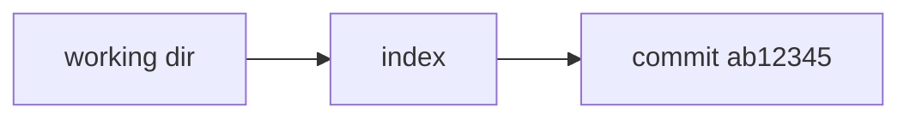

# Live Demo Patterns

Live demos are the most memorable part of a tech talk — and the most likely to fail. This reference documents patterns that make live demos reliable and give you a graceful fallback when they don't.

## The Dual-Pane Layout

The most useful layout for live coding: **commands or code on the left, result/visualization on the right.** Lets the audience see the cause and effect at once.

### Option A: Use built-in `two-cols`

```markdown
---
layout: two-cols
---

# Commands

```bash
git init
git add README.md
git commit -m "first commit"
```

::right::

# Repository state

```
.git/
├── HEAD
├── objects/
│   └── ab/c123...
└── refs/heads/main
```
```

**When to use:** quick side-by-side, any built-in theme, no setup.

### Option B: Custom `dual-pane` layout

For visually stronger separation (dark terminal on left, rendered output on right), create `layouts/dual-pane.vue`:

```vue
<template>
  <div class="h-full grid grid-cols-2">
    <div class="bg-neutral-900 text-neutral-100 p-8 flex flex-col justify-center font-mono text-sm overflow-auto">
      <slot name="left" />
    </div>
    <div class="p-8 flex flex-col justify-center">
      <slot name="right" />
    </div>
  </div>
</template>
```

Use it:

```markdown
---
layout: dual-pane
---

::left::

```bash
$ git log --oneline
ab12345 first commit
```

::right::


```

### Option C: Terminal-theme layout

For talks focused on CLI tools, simulate a terminal look:

```vue
<!-- layouts/terminal.vue -->
<template>
  <div class="h-full flex items-center justify-center bg-neutral-950 p-12">
    <div class="max-w-5xl w-full bg-neutral-900 rounded-xl shadow-2xl overflow-hidden">
      <!-- window chrome -->
      <div class="flex items-center gap-2 px-4 py-3 bg-neutral-800">
        <div class="w-3 h-3 rounded-full bg-red-500"></div>
        <div class="w-3 h-3 rounded-full bg-amber-500"></div>
        <div class="w-3 h-3 rounded-full bg-green-500"></div>
        <div class="text-neutral-400 text-xs ml-2">bash</div>
      </div>
      <div class="p-6 font-mono text-neutral-100">
        <slot />
      </div>
    </div>
  </div>
</template>
```

Use for slides that are "the user sees their terminal."

## Demo Choreography

A live demo has four states. Plan a slide for each transition.

### 1. Setup slide — "before I run anything"

Show the goal. What will the audience see?

```markdown
# Let's build a basic API

We'll create:

<v-clicks>

- `GET /health` returns `{ok: true}`
- Listens on port 8080
- Written in ~20 lines of Go

</v-clicks>

<!--
Speaker: keep this slide up while you open the editor.
Don't switch to the code view until they've seen the goal.
-->
```

### 2. Demo slide — pointer, not code

A minimal slide with just a `DEMO` marker. The actual work happens in your editor/terminal.

```markdown
---
layout: center
class: text-center
---

<div class="text-8xl font-bold tracking-tighter opacity-20">
  DEMO
</div>

<div class="text-xl mt-8 opacity-60">
  Building the API
</div>

<!--
Steps to run:
1. Open terminal: cd ~/demo
2. go run main.go
3. In another tab: curl localhost:8080/health
4. Show the JSON response
5. Kill the server with Ctrl+C

If the demo breaks: jump to slide 12 (recorded GIF).
-->
```

**Rule:** never put the code you're about to type on a slide. You'd just be reading it aloud, and the audience wonders why you type instead of advancing the slide.

### 3. Result slide — "what we saw"

After the demo, a slide summarizing the outcome.

```markdown
# What just happened

<v-clicks>

- Single `main.go` file
- Standard library only, no framework
- `go run` starts in ~200ms
- Survives a `curl` hit, returns JSON

</v-clicks>
```

### 4. Fallback slide — "if the demo fails"

Critical. Record a GIF of the working demo ahead of time. Drop it into a hidden slide:

```markdown
---
hide: true
routeAlias: demo-fallback
---

# Demo (recorded)


<!--
Jump here with <Link to="demo-fallback"> from the pointer slide
if the live demo fails.
-->
```

Link from the pointer slide so you can jump with one tap:

```markdown
<Link to="demo-fallback" class="text-sm opacity-40 hover:opacity-100">
  (if demo fails, click here)
</Link>
```

## Code-Evolution Patterns

When the story **is** the code evolving, don't live-type — use Magic-Move.

### Pattern: Refactor showcase

```markdown
# Refactoring `greet`

````md magic-move

```go
// Step 1: verbose, lots of work
func greet(name string) string {
    result := "Hello, "
    result += name
    result += "!"
    return result
}
```

```go
// Step 2: use fmt.Sprintf
func greet(name string) string {
    return fmt.Sprintf("Hello, %s!", name)
}
```

```go
// Step 3: the Go idiom
var greet = func(name string) string {
    return fmt.Sprintf("Hello, %s!", name)
}
```

````
```

Faster and cleaner than live-typing the refactor.

### Pattern: TDD cycle

```markdown
# TDD: red, green, refactor

````md magic-move

```go
// 1. RED — failing test
func TestAdd(t *testing.T) {
    if Add(2, 3) != 5 {
        t.Fatal("want 5")
    }
}
```

```go
// 2. RED + impl — still failing (doesn't compile)
func TestAdd(t *testing.T) {
    if Add(2, 3) != 5 { t.Fatal("want 5") }
}

func Add(a, b int) int {
    return 0   // obviously wrong
}
```

```go
// 3. GREEN — minimal fix
func TestAdd(t *testing.T) {
    if Add(2, 3) != 5 { t.Fatal("want 5") }
}

func Add(a, b int) int {
    return a + b
}
```

```go
// 4. REFACTOR — add docs, keep tests green
// Add returns the sum of two integers.
func Add(a, b int) int {
    return a + b
}
```

````
```

## Monaco Live Editing Patterns

Use Monaco only when you want the audience to change something.

### Pattern: "try it yourself"

```markdown
# Try it

```ts {monaco-run}
// Change the `name` — the greeting updates live
const name = 'World'
console.log(`Hello, ${name}!`)
```

<v-click>

**Challenge:** modify the function to greet multiple people at once.

</v-click>
```

Provide a minimal starting point. Don't paste 50 lines into Monaco — the audience can't read it.

### Pattern: buggy code to fix

```markdown
# Spot the bug

```ts {monaco-run}
function sum(nums: number[]): number {
  let total = 0
  for (let i = 1; i <= nums.length; i++) {
    total += nums[i]
  }
  return total
}

console.log(sum([1, 2, 3]))
```
```

Two bugs (off-by-one, off-by-one). Audience finds them, you fix them, everyone wins.

## Audience Interaction

Keeping the room engaged matters more than any slide. A few patterns worth knowing.

### Pattern: QR code to a link

Put a QR code on the slide so the audience can reach a URL without typing.

Simplest route: use the free QR Server API as an `` — no npm install:

```markdown
<div class="flex items-center gap-8">
  <div class="flex-1">
    <h2>Try it yourself</h2>
    <p class="opacity-70">Scan to open the demo.</p>
  </div>
  
</div>
```

For offline decks or privacy, generate a PNG locally (`qrencode -o public/qr.png 'https://example.com/demo'`) and reference `/qr.png`.

### Pattern: live poll (Slido, Mentimeter)

Embed a live poll via iframe. The audience participates in real time; results update on the slide.

```markdown
---
layout: iframe
url: https://app.sli.do/event/XXXX/embed/polls/latest
---
```

Use `layout: iframe-right` to keep a commentary column alongside. Slido and Mentimeter both provide embed URLs — check their docs for the exact format.

### Pattern: reveal a prompt, then the answer

Good for retention. Ask first, show the answer on click:

```markdown
# What's the output?

```ts
console.log(['1', '2', '3'].map(parseInt))
```

<v-click>

```
[1, NaN, NaN]
```

**Why:** `map` passes `(value, index)` — `parseInt('2', 1)` and `parseInt('3', 2)` both return `NaN`.

</v-click>
```

### Pattern: participation check

Quick temperature-check during a long session:

```markdown
# Checkpoint

Who has:

<v-clicks>

- Finished the first exercise? ✋
- Got to step 4? ✋
- Need more time? ✋

</v-clicks>

<div v-click class="mt-8 text-amber-400">
  If nobody raised their hand on step 4: slow down.
</div>
```

Calibrates your pace without a formal poll.

## Workshop-Specific Patterns

### Exercise marker

A visually distinct slide that signals "stop — the audience works now."

```markdown
---
layout: statement
class: bg-amber-500 text-neutral-950
---

<carbon-laptop class="text-8xl mx-auto mb-8" />

# Exercise

## 15 minutes

Create a `README.md` in your demo repo and commit it.

<!--
Start timer. Walk around and help.
Next slide when majority is done.
-->
```

### Checkpoint

Mid-workshop, realign the group:

```markdown
# Checkpoint

Everyone should have:

<v-clicks>

- A local git repo ✓
- At least 2 commits ✓
- A GitHub account open in the browser ✓

</v-clicks>

<div v-click class="mt-8 text-amber-400">
  Stuck? Ask a neighbor or raise your hand.
</div>
```

## Timing and Pacing

### Slide counts for common formats

| Format | Duration | Slides | Rule of thumb |
|---|---|---|---|
| Lightning talk | 5 min | 8–12 | ~30 sec per slide, one core idea |
| Meetup talk | 20 min | 20–30 | ~40 sec per slide, one demo |
| Conference session | 40–45 min | 30–50 | Two demos, Q&A, breathing room |
| Workshop | 2–3 hours | 40–80 | Half slides, half exercises/demos |
| Full-day workshop | 6–7 hours | 100–200 | Chapters, many exercises, breaks |

### Pacing tips

- **Open with a hook, not an agenda.** Agenda slides buy you nothing; the talk title already promised something.
- **One live demo per 15 minutes.** More than that and you spend all your time switching contexts.
- **Finish 2 minutes early.** Planning for 40 means running 42 — always.
- **Q&A slide is separate from the thank-you slide.** Audience reads the ending before the last question.

## Failure-Mode Planning

### Live coding crashes

- **Always** have `assets/demo-recording.gif` as a fallback
- Keep a **completed version** of the project in a separate folder — `cd ../demo-complete && go run .` as last resort
- Speaker notes with **the exact commands** to type, so you don't have to remember

### WiFi fails

- Local Slidev dev server works offline
- Download dependencies before the talk (`pnpm install` the day before)
- Use `remoteAssets: true` to cache remote images locally

### Projector resolution is wrong

- Pre-test with `aspectRatio: 16/9` (most common) and `canvasWidth: 1920` for 4K projectors
- Presenter mode shows on your laptop; audience sees only the main view

### Laptop dies

- Export PDF of the talk before going on stage
- Upload to a USB stick handed to organizer as emergency backup
- Conference laptops usually have Firefox/Chrome — PDFs open everywhere
